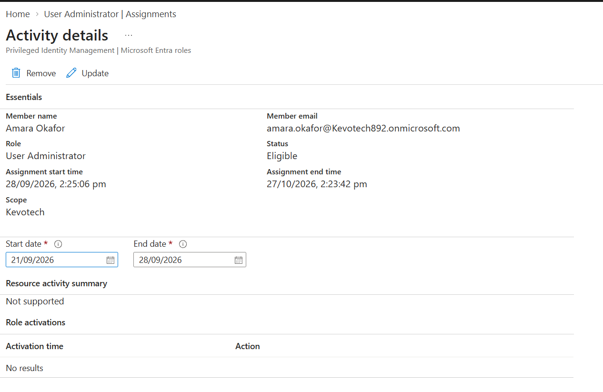
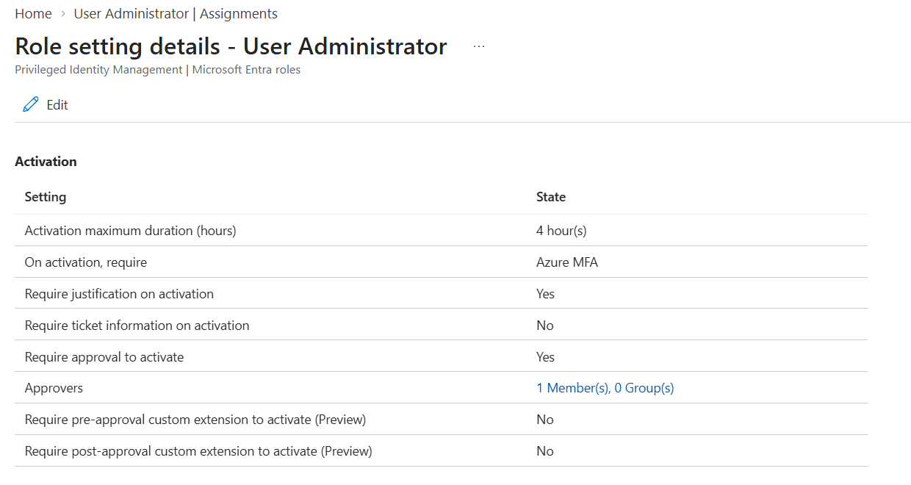
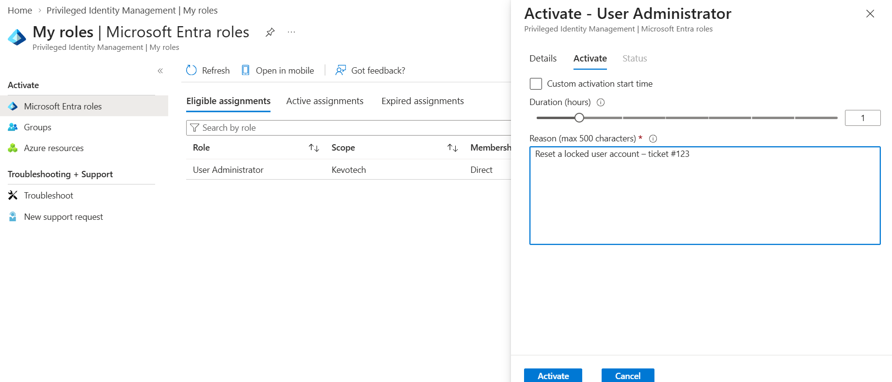
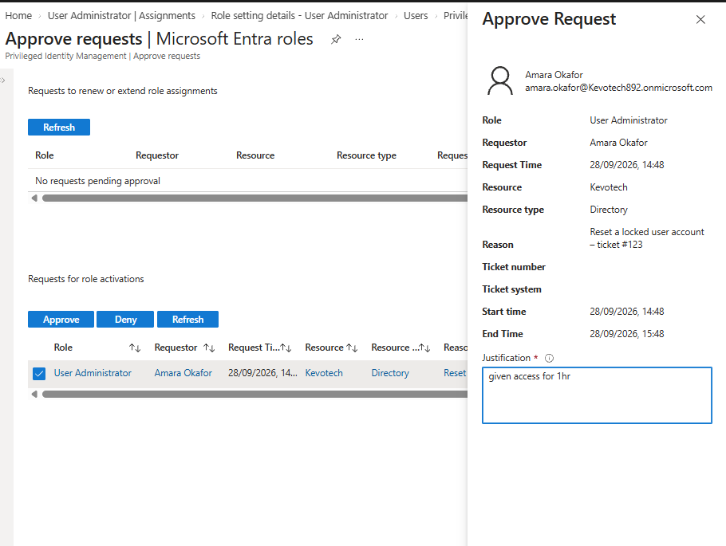
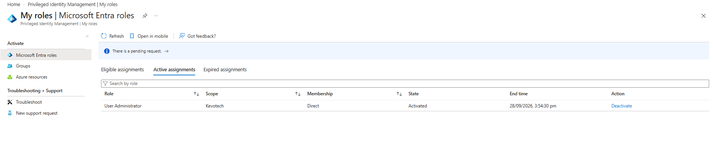
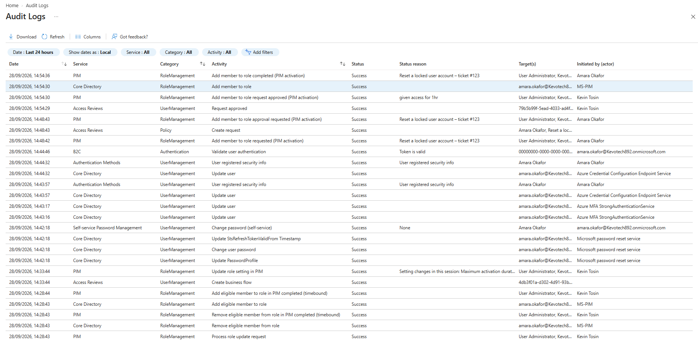

# Privileged Identity Management (PIM) in Microsoft Entra ID

**Platform:** Microsoft Entra ID (P2) · Privileged Identity Management
**Domain:** Identity & Access Management · Privileged access · Zero Trust
**Approach:** Eliminate standing admin access — eligible roles, just-in-time activation with MFA, justification, approval, time limits, and full audit

---

## The problem — a real-world attack, not a hypothetical

In **September 2022, Uber** was breached by an attacker who started with almost nothing: a contractor's stolen password and a flood of MFA push notifications until the contractor, worn down, approved one (an "MFA fatigue" attack). That got the attacker a foothold on the internal network — a *low-privilege* one.

It should have ended there. It didn't. Poking around an internal file share, the attacker found a **PowerShell script containing hard-coded administrator credentials for Uber's privileged access management (PAM) system** — an account with **standing, always-on admin access to the keys of the kingdom**. With it, the attacker reached AWS, Google Workspace, Slack, internal dashboards and more. A single compromised contractor became a near-total compromise. [1][2]

The root cause wasn't the phished password — it was the **standing privileged access** waiting behind it. A permanent, always-active admin account is a single point of catastrophic failure: steal it once, own everything, indefinitely. This is the most common escalation pattern in modern breaches, and it is exactly what Privileged Identity Management is built to remove.

## What this project is — and the skills it proves

This project builds and proves the control that breaks that escalation: **Privileged Identity Management (PIM)** in Microsoft Entra ID. Instead of admins holding privileged roles permanently, roles are made **eligible** — activated **just-in-time**, for a limited window, only after MFA, a written justification, and explicit approval, with every elevation logged. Standing admin access is eliminated, so there is nothing permanent for an attacker to find and steal.

It demonstrates the identity-engineering skills to design and operate least-privilege privileged access — the discipline behind Zero Trust's "least privilege" pillar and a core requirement of ISO 27001 and every serious access-control audit.

| What happened at Uber | What PIM changes |
|---|---|
| A standing admin account existed to be stolen | Privileged roles are **eligible, not active** — no standing admin to find |
| One credential = instant, full admin | Activation requires **MFA + justification + approval** — no self-serve admin |
| Access was persistent and indefinite | Every activation is **time-boxed** and **auto-expires** |
| Escalation went unnoticed | Every request, approval and activation is **logged and auditable** |

The rest of this document shows the build, a full live activation with approval, and the audit trail that proves it.

---

## The concept — Eligible vs Active

The whole model rests on one distinction:

- **Active** = the user holds the role *right now, permanently.* Standing access. The Uber risk.
- **Eligible** = the user *can activate* the role when they genuinely need it, but holds **zero** admin access by default.

PIM turns "always an admin" into "an admin for the next hour — because I asked, with a reason, approved, after MFA." Admin power exists only while it is actively being used, and never a moment longer.

---

## Build & proof

### 1. Eligible assignment — no standing access

A test user (Amara Okafor) is assigned the **User Administrator** role as **Eligible**, not Active. She *can* become an admin, but right now she holds no admin rights at all — and has zero role activations on record.

### 2. The guardrails — how activation is allowed

The role's activation policy sets the conditions that must be met to elevate: a **4-hour maximum duration**, **Azure MFA required**, a **justification required**, and **approval required** by a designated approver. These are the rules that make privileged access accountable rather than self-serve.

### 3. Just-in-time activation request

Amara requests activation of User Administrator — choosing a duration (1 hour) and entering a business justification (*"Reset a locked user account – ticket #123"*), after passing MFA. Because approval is required, the request does not grant access immediately; it goes to **pending approval**.

### 4. Approval — a second human gates the elevation

The designated approver (Kevin Tosin) reviews the request — who is asking, for which role, why, and for how long — and approves it. No one grants themselves admin.

### 5. Active, time-boxed access

On approval, Amara's role becomes **Active** — but only for the requested window, with a visible expiry time. When it lapses, the role deactivates automatically and she returns to zero standing access.

### 6. Full audit trail

Every step is written to the audit log — the eligible assignment, the policy change, the activation request, the approval, and the completed activation — each with the actor, timestamp, status, and the justification. This is the "every elevation is accountable" evidence an ISO 27001 or SOX access-control audit requires.

---

## Key design decisions

- **Eligible, not active.** No privileged role is left permanently assigned. This is the single change that removes the standing-admin single point of failure the Uber breach exploited.
- **Defence in depth on activation.** MFA (prove it's really you), justification (a logged reason), approval (a second human), and a time limit (auto-expiry) — four independent controls on a single elevation.
- **Approval separates request from grant.** The requester and the approver are different people, so a compromised user cannot self-elevate.
- **Everything is logged.** The audit trail ties directly to GRC and compliance — it answers "who had admin, when, why, and who approved it" on demand.
- **Least privilege as a live control.** PIM is the operational form of Zero Trust's least-privilege pillar: the minimum access, only when needed, only for as long as needed.

---

## Future improvements

- **Apply to Global Administrator and other high-tier roles**, with tighter settings (shorter windows, stricter approval) than lower roles.
- **Access reviews on privileged roles** — periodic recertification that eligible assignments are still justified.
- **Alerting** on suspicious PIM activity (activation outside business hours, too many active admins) fed into Microsoft Sentinel — the identity-to-detection bridge.
- **PIM for Groups** to bring the same just-in-time model to privileged group memberships and app roles.

---

## Skills demonstrated

· Privileged Identity Management (PIM) design and operation
· Just-in-time (JIT) privileged access
· Eligible vs active role assignment
· Activation policy — MFA, justification, approval, time-boxing
· Approval workflow design (separation of request and grant)
· Privileged access auditing for compliance (ISO 27001 / SOX)
· Zero Trust least-privilege enforcement
· Mapping controls to a real-world breach

---

## References

1. GitGuardian — [Uber Breach 2022 – Everything You Need to Know](https://blog.gitguardian.com/uber-breach-2022/) (finding of hard-coded PAM admin credentials on an internal share).
2. CyberArk — [Unpacking the Uber Breach](https://www.cyberark.com/resources/blog/unpacking-the-uber-breach) (privilege escalation from a low-level foothold via standing privileged access).
